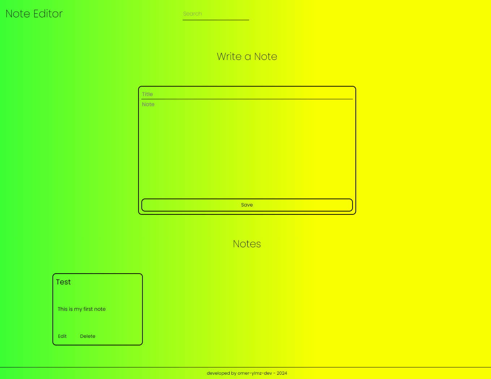
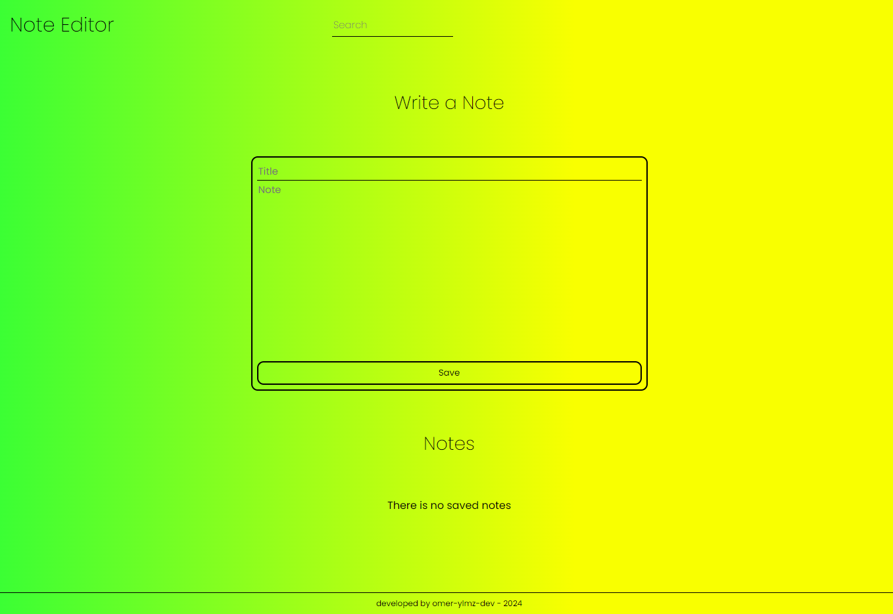

# NoteEditor - Vanilla JS Project

  

## About

This is an simple note editor. You can save your notes and edit or delete them. Also you can search a specific note into the notes

## Development

This project's backend was developed with only Vanilla JS and the frontend was developed with HTML5 + CSS3

Your notes will be saved in localStorage

## Gallery

